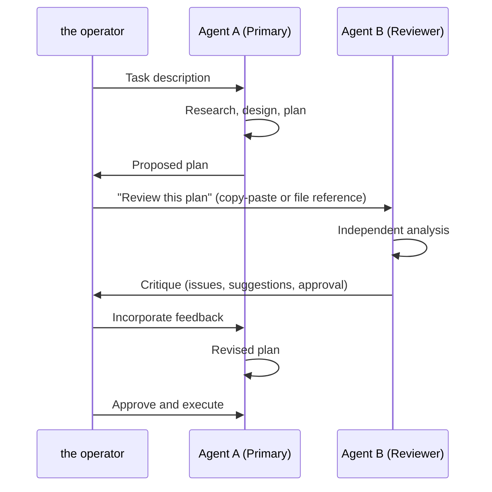

# Cross-Model Critique

> *What happens when you ask Claude to review Gemini's plan — and why the disagreement is the point.*

---

## The Pattern

One of the most valuable workflows in the Z-Brain project wasn't planned. It emerged from necessity and became a standard practice.

The pattern: **Submit one AI model's implementation plan to a different AI model for critique before executing it.**

This isn't the same as "getting a second opinion." It's more specific than that. Each model has different strengths, different blind spots, and different reasoning patterns. When Model A produces a plan, it's internally consistent — but it may contain assumptions that Model A can't see because they're baked into how Model A reasons. Model B, with a different architecture and different training, will trip over those assumptions.

The disagreement surface between models is where the most critical bugs hide.

## Case Study: The synth-mcp Migration Plan

### The Original Plan (Gemini)

During session e03cd5be, a plan was developed to migrate synth-mcp from the legacy SSE transport to Streamable HTTP. The plan's diagnosis identified a client-side lifecycle bug in how Hermes's `mcp_tool.py` managed SSE connections. The treatment was a server-side transport rewrite — replacing the SSE server with a new Streamable HTTP implementation.

The plan was internally consistent. The diagnosis explained the symptoms. The treatment addressed the diagnosis. Reviewed in isolation, it looked solid.

### The Critique (Claude Opus 4.8)

The plan was submitted to Claude Opus 4.8 for independent review. Opus delivered critical feedback:

**The diagnosis was incompatible with the treatment.**

If the bug was client-side (how `mcp_tool.py` managed connections), then rewriting the server-side transport wouldn't fix it. The client would have the same lifecycle bug regardless of whether the server used SSE or Streamable HTTP. Either the diagnosis was wrong (and the bug was server-side), or the treatment was wrong (and the fix should be client-side).

This wasn't a subtle point — it was a fundamental logical inconsistency. But it was invisible from inside the original reasoning because the plan had been constructed incrementally: diagnose first, then design treatment. The treatment felt like a natural progression from the diagnosis, even though it addressed a different layer.

### The Resolution

The plan was rewritten to lead with instrumentation rather than assuming the root cause. The 10-point instrumentation patch was applied inside the container, and testing revealed that the previous session's `raw-transport.js` rewrite had already fixed the actual bug (which WAS server-side — the diagnostic `server-minimal.js` was being imported instead of the real `server.js`).

Claude's critique was valuable even though the root cause turned out to be server-side, because it forced the investigation to verify rather than assume.

## Case Study: The Hermes Upgrade Plan

### The Original Plan (Antigravity/Claude)

Session 05f5df02 produced a plan for upgrading Hermes Agent from v0.14.0 to v0.15.1 and CORE from v0.7.13 to v0.7.14. Two containers, two different codebases, shared databases, bind-mounted volumes, live production data.

### The Cross-Model Review (Codex + Claude Opus 4.8)

Both Codex (gpt-5-codex) and Claude Opus 4.8 independently reviewed the plan. Both, working separately, identified 6 critical issues:

1. **SQLite backup safety** — The plan didn't specify atomic backups (using Python's `.backup()` API vs. just copying the file, which risks corruption if the database is being written to)
2. **Postgres rollback** — No explicit rollback procedure if the CORE upgrade broke the database schema
3. **Target pinning** — Docker image tags weren't pinned to SHA256 digests, risking different pulls on different runs
4. **Upgrade ordering** — The plan didn't specify whether to upgrade CORE or Hermes first (matters because Hermes depends on CORE's MCP servers)
5. **MCP server verification** — No post-upgrade check that all MCP servers reconnected
6. **Data volume preservation** — The plan assumed but didn't verify that bind-mounted volumes would survive the container recreation

All 6 issues were incorporated into the revised plan. The upgrade succeeded with zero data loss (237 sessions, 7,142 messages preserved).

## Why Cross-Model Works

### Different architectures see different things

Claude tends toward careful analysis of logical consistency (as in the synth-mcp case). Codex tends toward implementation-level concerns (as in the SQLite backup safety concern). Gemini tends toward ambitious scope but sometimes under-specifies edge cases. These aren't flaws — they're complementary strengths.

### Same-model review has blind spots

If you ask the same model to review its own plan, it will usually approve it. The plan was generated by the model's reasoning process, and the review uses the same reasoning process. Systematic biases survive self-review.

### The friction is productive

When Claude says "this diagnosis is incompatible with this treatment," that's not an obstacle — it's the system working. The moment of disagreement is the moment where an assumption becomes visible. Without the disagreement, the assumption stays hidden until it becomes a bug in production.

## How It Works in Practice

The human (the operator) is the bridge. Agent A and Agent B never communicate directly. The cross-model critique works through shared artifacts — the plan document — mediated by the human who can evaluate both perspectives.

This is the "Meta-Product Owner" role in action: not writing code, not designing architecture, but orchestrating multiple AI perspectives to produce a result better than any single model could achieve alone.

## The Limits

Cross-model critique isn't a silver bullet:

- **It's token-expensive.** Each review consumes a full context window of the reviewing model.
- **It's time-consuming.** The plan-review-revise cycle adds a full round-trip to the development process.
- **Not every plan needs it.** Simple, well-understood changes don't benefit from cross-model review. Reserve it for high-stakes decisions: upgrades, architectural changes, security-sensitive modifications.
- **The models can agree on the same wrong thing.** If all models share a training-data blind spot, cross-model review won't catch it. The human reviewer remains essential.

## When to Use It

In the Z-Brain project, cross-model critique is triggered for:
- Container upgrades (data loss risk)
- Architectural changes (cascading impact)
- Security modifications (SOUL.md rules, auth changes)
- Transport/protocol changes (synth-mcp, MCP integration)
- Any plan longer than ~50 lines

For routine work — adding a glossary entry, updating a timeline, fixing a typo in SOUL.md — a single agent is sufficient.

---

*This chapter was drafted by Antigravity IDE (Claude Opus 4, Thinking) during session 5198c89f on 2026-06-05. It draws from sessions e03cd5be (synth-mcp Resolution, Cross-Model Critique) and 05f5df02 (Hermes + CORE Upgrade). The synth-mcp critique was performed by Claude Opus 4.8; the upgrade review was performed independently by both Codex (gpt-5-codex) and Claude Opus 4.8.*
