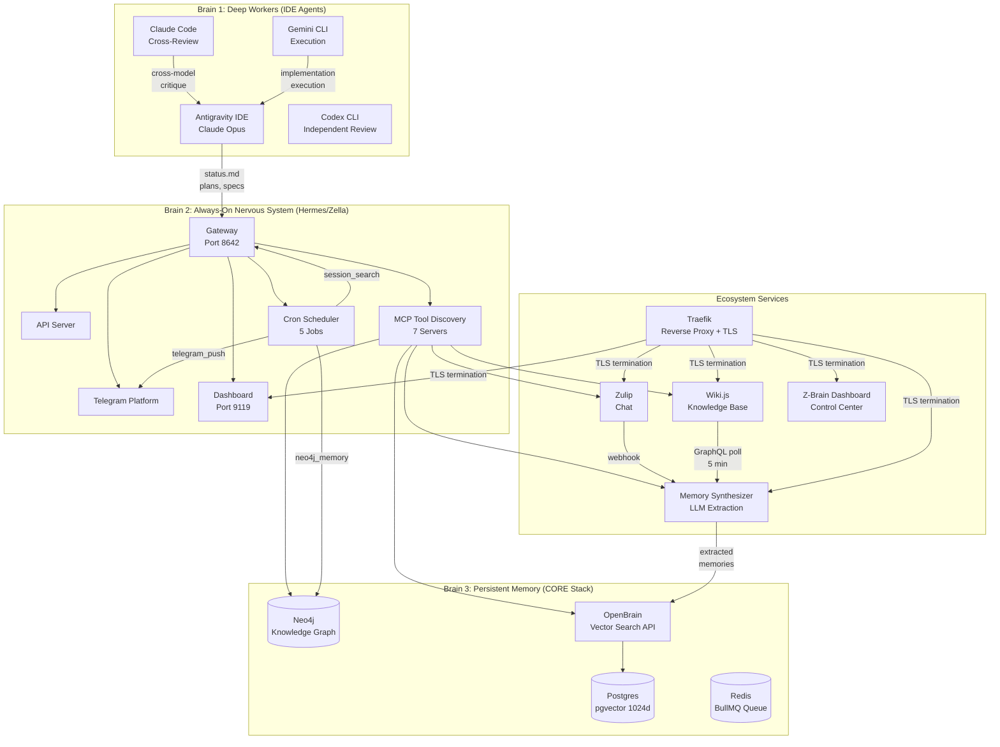
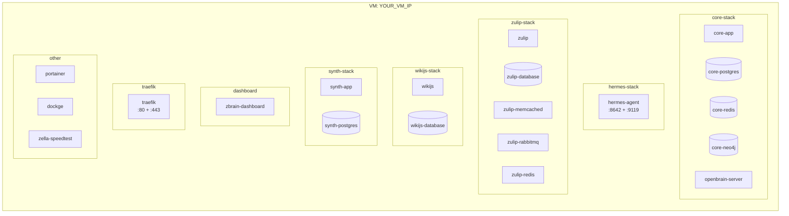
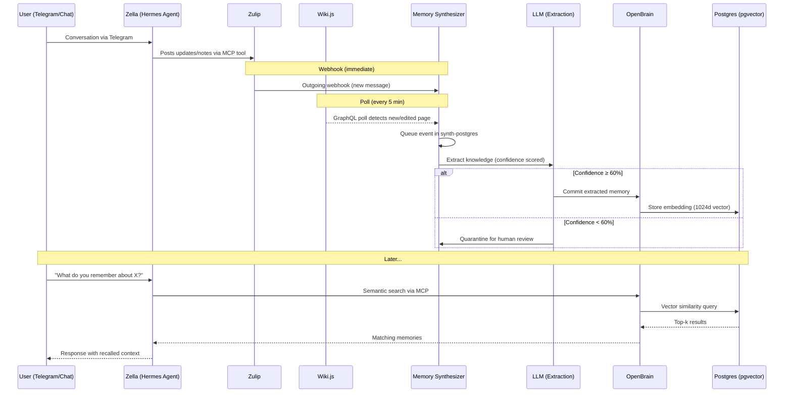
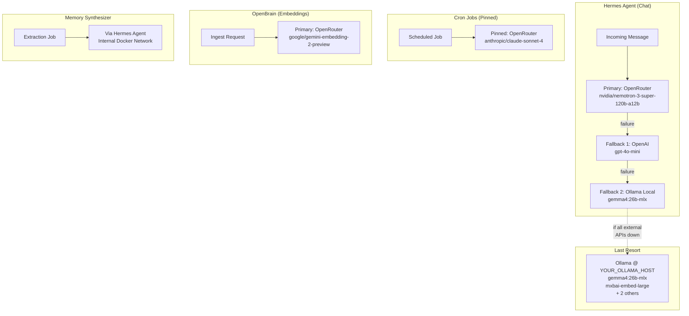

# Architecture Overview

> The complete technical architecture of Z-Brain as of June 2026.

---

## System Architecture

Z-Brain runs on a single homelab VM (`YOUR_VM_IP`) with 22 Docker containers across 8 service stacks. The architecture is organized into three conceptual layers that map directly to Chris Lema's ["Three Brains" framework](../appendices/external-references.md#chris-lema--your-ai-has-three-brains):



---

## Container Topology

All containers run on a single Docker host. Communication between stacks uses Docker's `agent-net` bridge network for internal traffic, with Traefik providing TLS-terminated external access.



---

## Data Flow: Memory Pipeline

The automatic memory pipeline runs 24/7 with zero human intervention. The only AI model call is the extraction step.



---

## Provider Routing

Z-Brain uses a multi-provider architecture with fallback chains. No single provider failure can take down the system.



> **Why model pinning for cron?** The default model (`nvidia/nemotron-3-super-120b-a12b`) causes 180-second stream stalls on OpenRouter during cron workloads. After multiple incidents requiring container restarts, all LLM-powered cron jobs were pinned to `anthropic/claude-sonnet-4` which has been reliable.

---

## Cron Job Architecture

Five automated jobs run on the Hermes scheduler:

| Job | Schedule | Type | Purpose |
|---|---|---|---|
| Docker Stack Monitor | Every 5 min | Script | Monitors all container health and alerts on failures |
| File System Monitor | Every 10 min | Script | Watches data volumes for disk usage and anomalies |
| Memory Systems Health Check | Every 3 hours | LLM | Verifies CORE, OpenBrain, Neo4j, and MCP connectivity |
| Neo4j KG Auto-Update | Every 2 hours | LLM | Mines recent sessions for entities and relationships |
| Daily Weather Report | 10 AM daily | LLM | Fetches and delivers weather for configured locations |

### The `enabled_toolsets` Gotcha

LLM-powered cron jobs use `enabled_toolsets` in `jobs.json` as a **strict whitelist filter**. Even though `discover_mcp_tools()` registers all 63 MCP tools at startup, tools whose toolsets aren't in the whitelist are filtered out before the agent can use them. This was the root cause of the KG Auto-Update failing to write to Neo4j — the `neo4j_memory` toolset was discovered but filtered.

See: [Chapter 8: The Gateway Boot Paradox](../chapters/08-the-gateway-boot-paradox.md)

---

## Security Model

| Layer | Mechanism |
|---|---|
| Network | VM on private LAN. External access only through Traefik (HTTPS) |
| Traefik TLS | Wildcard Let's Encrypt cert for `*.zb.example.com` (Cloudflare DNS-01) |
| Hermes API | `API_SERVER_KEY` bearer token |
| Hermes Dashboard | `_SESSION_TOKEN` auth (native), basic auth for external access |
| Terminal Isolation | `terminal.backend: local` prevents container-to-host escape |
| SOUL.md Security Rules | Prohibits API key extraction, raw DB queries, Docker socket self-abuse |
| Docker Socket | Mounted for monitoring but SOUL.md rules prevent Zella from running `docker exec` on herself |

---

## Key Architectural Decisions

| Decision | Choice | Rationale |
|---|---|---|
| Self-hosted vs. cloud | Self-hosted on homelab VM | Full ownership of data, no SaaS lock-in, no usage limits |
| Vector DB | Postgres + pgvector | Already using Postgres; pgvector avoids a separate service (Pinecone, Weaviate) |
| Knowledge graph | Neo4j Community | Best-in-class for relationship queries; temporal metadata on edges |
| Agent runtime | Hermes Agent | Open source, MCP-native, multi-platform, active development |
| Chat system | Zulip | Topic threading > Slack's flat channels; self-hostable; good webhook support |
| Wiki | Wiki.js | GraphQL API, clean UI, self-hostable, Node.js ecosystem |
| Model routing | OpenRouter | Single API key for multiple providers; easy fallback switching |
| Reverse proxy | Traefik | Docker-native, automatic TLS, label-based routing |
| Queue system | BullMQ (Redis) | Already using Redis; BullMQ is battle-tested for Node.js job queues |
| Synthesizer DB | Dedicated Postgres | Isolation from CORE; avoids pgvector index conflicts |
| Dashboard framework | Next.js | Server-side rendering for real-time data; React for interactive UI |
| Config management | `config.yaml` in bind-mounted volume | Persists through container restarts; readable at startup |
| Behavior tuning | `SOUL.md` (loaded fresh each message) | No restart needed for personality/behavior changes |

---

## File System Layout (Container)

```
/opt/data/                    # Bind-mounted from VM's ~/docker/hermes-stack/data/
├── config.yaml               # Gateway configuration (read at startup)
├── SOUL.md                   # Personality + behavior (read fresh each message)
├── state.db                  # SQLite: all sessions + messages
├── auth.json                 # Platform auth tokens
├── .env                      # Environment overrides
├── .ssh/                     # SSH keys for host loopback
├── cli-secrets/              # Credential files for CLI tools
└── sandboxes/                # Terminal execution sandboxes

/opt/mcp/                     # Bind-mounted from VM's ~/docker/hermes-stack/mcp/
├── neo4j-memory/             # Neo4j MCP server
├── openbrain/                # OpenBrain MCP server
├── telegram-push/            # Telegram notification MCP server
├── synth-mcp/                # Synthesizer control MCP server
├── wikijs/                   # Wiki.js publishing MCP server
├── zulip/                    # Zulip posting MCP server
└── z-brain/                  # CORE Memory OS MCP server
```

> [!WARNING]
> **`/opt/data/` is the live bind mount.** The local git checkout at `/Volumes/nvme-2tb/ant-workspace/z-brain/hermes-stack/data/` is NOT the running configuration. Editing the local copy has no effect on the container. Always edit inside the container via `docker exec`, then sync back to local for git history.

---

*This architecture overview is a living document, updated as the system evolves. Drafted by Antigravity IDE (Claude Opus 4, Thinking) during session 5198c89f on 2026-06-05.*
