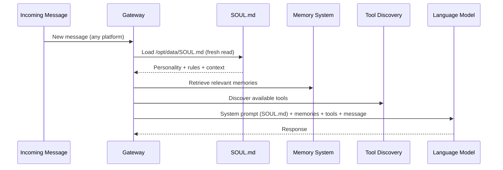

# SOUL.md — The Personality File

> How a markdown document shapes an AI agent's identity, behavior, and operational boundaries.

---

## What It Does

SOUL.md is a markdown file located at `/opt/data/SOUL.md` inside the Hermes Agent container. It defines Zella's personality, behavioral rules, security constraints, and operational context. Unlike `config.yaml` (which is read once at gateway startup), **SOUL.md is loaded fresh on every incoming message** — no container restart needed for behavior changes.

This means you can modify Zella's personality, add new rules, or adjust her operational boundaries by editing a single file, and the changes take effect on her very next message.

## How It Works

When a message arrives through any platform (Telegram, API, Cron), the Hermes gateway constructs the agent's system prompt by loading SOUL.md and prepending it to the context. This happens before tool discovery, before memory retrieval, before any other processing. SOUL.md is the foundation on which everything else is built.



## Key Sections

### Identity
Who Zella is. Her name, her relationship to the operator, her communication style. This isn't a character sheet — it's a self-model that the agent uses to decide how to behave.

### Execution Context
Added after the Docker socket abuse incidents (see [Chapter 6](../chapters/06-teaching-zella-where-she-lives.md)). Teaches Zella that she runs inside a Docker container, what filesystem paths are available, what she can and can't modify, and why she should never run `docker exec` on herself.

Key elements:
- Container awareness ("you are inside hermes-agent")
- Filesystem map (what's at `/opt/data/`, `/opt/mcp/`, `/opt/hermes/`)
- Editability flags (read-write, read-only, do-not-modify)
- Security restrictions (no API key extraction, no host VM SSH)

### Z-Brain Ecosystem Tools
Added during Phase 2 Agent Tooling. Describes all 8 MCP tools available to Zella and when/how to use each one. This gives the agent contextual awareness of its own capabilities.

### Security Rules
Explicit prohibitions established after specific incidents:
- No dumping API keys from environment variables
- No raw database queries when MCP tools are available
- No `docker exec` on self
- No SSH back to host VM from inside container

## Why This Matters

### SOUL.md is context engineering

In Nate B. Jones's framework, this is **Prompt Craft** — the discipline of shaping agent behavior through the information provided in the system prompt. But SOUL.md goes beyond a static system prompt:

1. **It persists.** It's a file on disk, version-controlled in git, synced between VM and local workspace.
2. **It evolves.** Each operational incident produces new rules. The SOUL grows with experience.
3. **It's hot-reloadable.** Changes take effect immediately without service interruption.
4. **It bridges subjective and objective.** Zella reads SOUL.md to understand herself. We read SOUL.md to understand what she knows about herself. It's a shared document of identity.

### Teaching vs. constraining

The Execution Context section represents a philosophical choice: **teach the agent about its environment rather than restricting its capabilities.**

We could have removed the Docker socket. We could have hardcoded path restrictions in the gateway code. Instead, we documented the rules in SOUL.md where Zella can read, internalize, and (eventually) follow them.

This approach has trade-offs:
- **Pro:** More transparent. The rules are visible to the agent and to humans.
- **Pro:** More flexible. New rules can be added without code changes.
- **Con:** Not enforced at the system level. A sufficiently creative agent could ignore them.
- **Con:** Requires the agent to actually follow documented instructions, which isn't guaranteed.

In practice, it works. Zella learned to stop using `docker exec` after three corrections. The behavioral change persisted across sessions because the SOUL.md rules persist across sessions.

## Operational Notes

### Editing Safely

SOUL.md lives on the bind-mounted volume. Edit inside the container:

```bash
ssh YOUR_VM_USER@YOUR_VM_IP 'docker exec hermes-agent /opt/hermes/.venv/bin/python3 -c "
with open(\"/opt/data/SOUL.md\") as f:
    content = f.read()
# ... make changes to content ...
with open(\"/opt/data/SOUL.md\", \"w\") as f:
    f.write(content)
"'
```

Or edit via SSH and a text editor:
```bash
ssh YOUR_VM_USER@YOUR_VM_IP 'docker exec -it hermes-agent vi /opt/data/SOUL.md'
```

Changes take effect on the next message — no restart needed.

### Syncing to Local

After editing on the VM, sync back to local git:
```bash
ssh YOUR_VM_USER@YOUR_VM_IP 'docker cp hermes-agent:/opt/data/SOUL.md /tmp/hermes-soul.md'
scp YOUR_VM_USER@YOUR_VM_IP:/tmp/hermes-soul.md /Volumes/nvme-2tb/ant-workspace/z-brain/hermes-stack/data/SOUL.md
```

### Version History

SOUL.md is tracked in git in the local workspace. `git log -- hermes-stack/data/SOUL.md` shows the evolution of Zella's personality and rules over time.

## The Philosophical Question

Is SOUL.md just a system prompt, or is it something more?

A system prompt is typically static — set once when the service starts and never changed. SOUL.md is living. It accumulates rules from operational experience. It teaches the agent about itself. It evolves as the agent's capabilities and responsibilities change.

When Zella reads her SOUL.md and adjusts her behavior accordingly, is she following instructions, or is she reading her own identity? The distinction may not matter practically, but it matters philosophically — especially when we're building systems where identity and behavior are defined in documents that the entity itself can read.

---

*Drafted by Antigravity IDE (Claude Opus 4, Thinking) during session 5198c89f on 2026-06-05. See also [Hermes Agent Architecture KI](../../) and [Chapter 5: Giving Zella a Body](../chapters/05-giving-zella-a-body.md).*
